

<a href="mailto:ssonalipduoh@gmail.com">📧 Email</a>
<a href="https://www.linkedin.com/in/sonali-sharma-50220210b/">LinkedIn</a>
<a href="cv/SonaliSharma_CV.pdf">Download CV</a>

# Sonali Sharma

I am a Geospatial Analyst and Urban ecologist actively seeking opportunities to deliver nature-positive and climate resilient
solutions at the intersection of Earth observation, GeoAI and Environmental planning. 
With 7+ years of experience, I specialize in transforming complex 2D & 3D spatial data into planning-relevant
insights that cities, regions and nature need. I have built geospatial workflows connecting LiDAR, high resolution land cover
and socio-economic data for urban and nature environments.

I hold a PhD in Environmental Sciences and bring international work experiences across India, Germany, and Finland.
My work is driven by the aim of using spatial analysis as a bridge between data, eco-environmental systems, and decision-making.
With spatial skillsets, interdisciplinary background and cross-cultural adaptability, I am particularly interested 
to be part of organisations where geospatial intelligence can support climate adaptation, 
biodiversity-sensitive and nature-based solutions planning.

**Interests**

<ul class="interests-grid">
  <li>Earth Observation & Satellite Data Science</li>
  <li>GeoAI & Spatial Deep Learning</li>
  <li>Remote Sensing & GIS Analytics</li>
  <li>LiDAR for Built & Green (3-D) Structure Analysis</li>
  <li>Urban & Environmental Planning</li>
  <li>Green Infrastructure & Nature-based Solutions</li>
  <li>Biodiversity; Landscape & Urban Ecology</li>
  <li>Ecosystem Services Modelling</li>
  <li>Carbon Accounting & Climate Reporting</li>
  <li>Reproducible Geospatial Workflows</li>
  <li>Science–Policy Interface</li>
</ul>

  

  

---

## Work Experiences

<h3 class="tl-title">Postdoctoral Researcher</h3>

University of Helsinki, Finland

Sep 2023 – Oct 2025

Automated GIS workflows integrating LiDAR and high-resolution land cover data, cutting processing time by 70%. 
Built reproducible ML pipelines for 3D urban and green structure analysis. 
Analysed bird biodiversity data to link species occurrence with urban structural heterogeneity, 
producing planning-relevant spatial insights. Coordinated interdisciplinary work with the Finnish 
Environment Institute, delivering scientific outputs and map products. 
Presented findings at stakeholder engagement workshops and international conferences.

  PythonRLiDARHPCQ/ArcGISMachine learning
  3D Urban typologyHybrid associationsStakeholder engagementScientific reportingUrban biodiversity planning

<h3 class="tl-title">Visiting Doctoral Researcher &nbsp;DAAD Fellow</h3>

Martin-Luther-Universität Halle-Wittenberg, Germany

Aug 2020 – Sep 2021

DAAD Bi-national Fellowship recipient. Led research on future plausible urban growth and climate change scenarios and their implications on ecosystem services. Worked with German research teams and presented at international conferences focused on sustainability and geospatial methods.

  ArcGISPythonRGoogle Earth EngineIPCC climate scenariosUrban growth modelling

<h3 class="tl-title">Doctoral Researcher (PhD)</h3>

Jawaharlal Nehru University, New Delhi, India

Aug 2018 – Jun 2023

Modelled urban ecosystem services — soil erosion, flood regulation, heat regulation, and carbon sequestration — across two Himalayan landscapes. 
Integrated multi-source datasets (climate, land cover, remote sensing) to analyse urban growth dynamics and heat island effects.
Mentored junior researchers in GIS workflows and spatial data processing.

  ArcGISPythonRGoogle Earth EngineEcosystem ServicesWatershed modellingSpatio-temporal assessmentSocio-economic dataHeat island mapping

---

## Projects

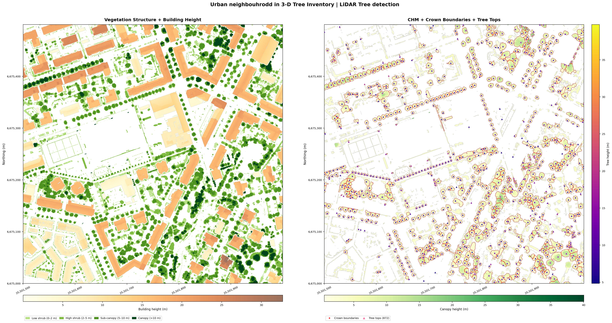

*How Many Trees — and How Tall Are the Buildings?*   
**Automated Urban Structure Inventory from LiDAR**

LiDAR · Individual Tree Detection · Crown Delineation · Building Heights · Green Infrastructure 

Urban green planners spend hundreds of Euros on manual tree surveys. This pipeline 
turns a single open-access LiDAR file into a complete urban structure inventory
— with shrubs as height-classified vegetation patches & 872 individual trees — with locations, heights, and crown extents; 
alongside wall-to-wall building heights — in one reproducible notebook run.  
Ready to feed directly into green infrastructure audits, urban heat mitigation plans, shadow modelling
or carbon accounting workflows.

[View notebook →](notebooks/01_lidar_tree_detection.html)

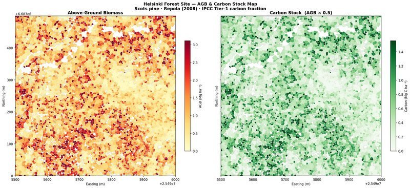

*How much Carbon does your urban forest store?*   
**Wall-to-Wall Carbon Mapping from LiDAR**

LiDAR Carbon mapping · Repola allometrics · IPCC Tier-1 carbon conversion · Voluntary Carbon Markets

Municipal climate accounts and voluntary carbon markets demand spatially explicit, auditable carbon estimates — 
not averages extrapolated from field plots.
This pipeline goes from a single open-access LiDAR tile to a wall-to-wall carbon stock map at individual 
tree resolution across an urban forest site in Helsinki.
Every tree counted, every tonne traceable — and fully scalable to landscape-wide coverage with additional tiles.

[View notebook →](notebooks/04_agb_carbon_mapping.html)

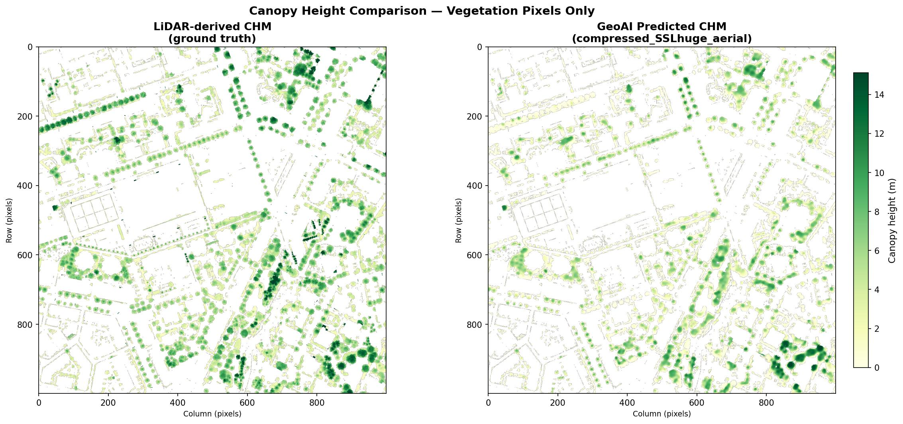

*Can GeoAI replace LiDAR for Urban Canopy Mapping?*   
**A Pixel-Level Validation**

LiDAR · GeoAI · Deep Learning · Canopy Height Model · Accuracy Assessment · Residual Mapping · Urban

LiDAR is accurate but not freely omnipresent yet. Deep learning models trained on aerial imagery 
promise a cheaper, scalable alternative — but do they actually hold up?
This notebook delivers a pixel-level validation of 
GeoAI's SSL-pretrained canopy height model against airborne LiDAR as ground truth 
across a Helsinki urban neighbourhood.

[View notebook →](notebooks/02_Urban_geoai_vs_lidar_validation.html)

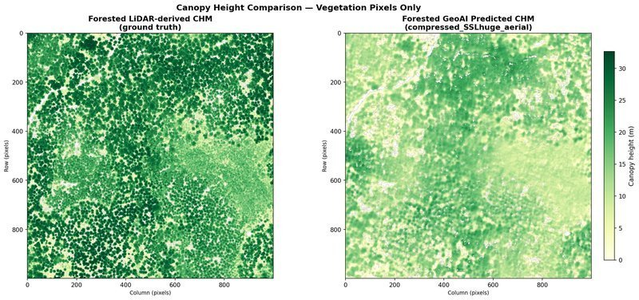

*Can GeoAI replace LiDAR in a forest?*   
**A Pixel-Level Validation**

LiDAR · GeoAI · Deep Learning · Canopy Height Model · Accuracy Assessment · Residual Mapping · Forest

LiDAR is accurate but not freely omnipresent yet. Deep learning models trained on aerial imagery 
promise a cheaper, scalable alternative — but do they hold up in dense forest 
where the canopy is closed and individual crowns are harder to resolve? This 
notebook delivers a pixel-level validation of GeoAI's SSL-pretrained canopy height 
model against airborne LiDAR as ground truth across a Helsinki forested site.

[View notebook →](notebooks/03_Forest_geoai_vs_lidar_validation.html)

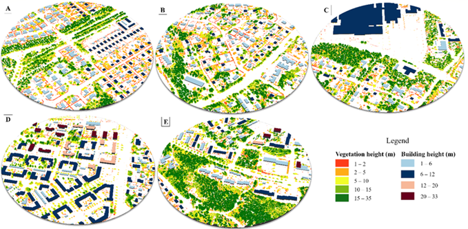

*How different Housing Types look in 3-D?*   
**3D built-green typologies — Nordic residential areas**

LiDAR · 3D Urban Typology · Green Infrastructure · Vegetation Structure · Lahti

Not all residential areas relate to green infrastructure the same way — and planning 
that ignores this distinction misses where and what investment is most needed.
This project explored five LiDAR-based urban-green typologies.  
A direct planning tool for identifying which housing types 
need which vegetation layer — shrub, sub-canopy, or canopy — and where.
[View full project →](projects/urban-typologies.qmd)

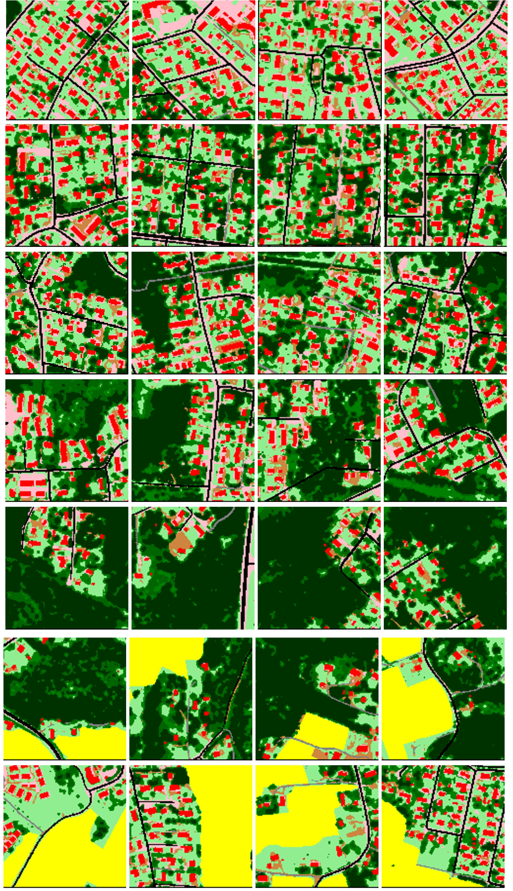

*How does Helsinki Metropolitan region look like 3-D?*   
**Automating the capture of Urban Residential Typology — Built-Vegetation Hybrid Associations**

Transfer learning · CNN · LiDAR · 2 m LULC · Under review

A scalable approach to capture residential typology hybrid associations across the 
Helsinki Metropolitan Area — combining deep learning with building and vegetation 
height information at planning scale. Attempts to answer questions like : Can GeoAI help design better cities by 
identifying green infrastructure needs at planning scale? Do green infrastructure 
needs fundamentally differ between detached housing and high-rise flats? Which 
housing types need investment and what vegetation layers — shrub, sub-canopy, 
or canopy — are missing?

*Code releasing on paper acceptance*

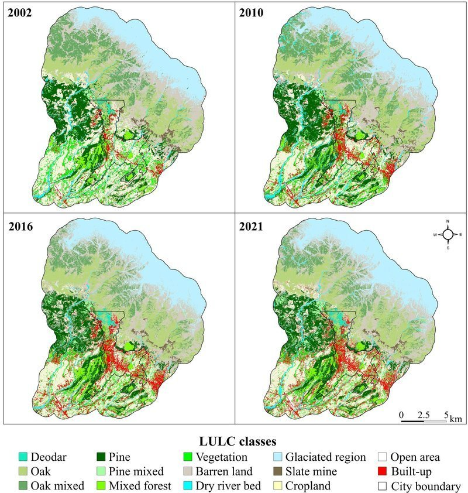

*How did urbanisation unfold in Indian Western Himalaya over past two decades?*   
**Spatio-temporal LULC assessment**

Land Cover Change · Sentinel · Aster DEM · Published | Land (2022)

Unplanned urban growth in mountain cities rarely makes headlines.
Two decades of urbanisation-induced land cover change mapped at 
species-level resolution across Dharamshala and Pithoragarh using open-source satellite data. 
Quantified what, how much, and where natural and semi-natural land units were lost — 
directly actionable for mountain city planners.

[View full project →](projects/lulc-himalaya.qmd)

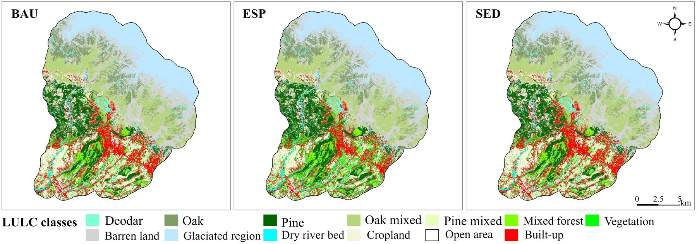

*What could the Western Himalayan landscapes look like by 2040?*   
**Future Studies: Urban growth scenarios**

IDRISI/TerrSet · ArcGIS

Unplanned growth in mountain cities rarely follows a single path — but planners 
need to see all of them. Three plausible futures — Business As Usual, Ecosystem 
Protection, Development-First. Spatial maps designed for stakeholder deliberation: 
What does each plausible path look like on the ground by 2040?

[View full project →](projects/urban-growth-scenarios.qmd)

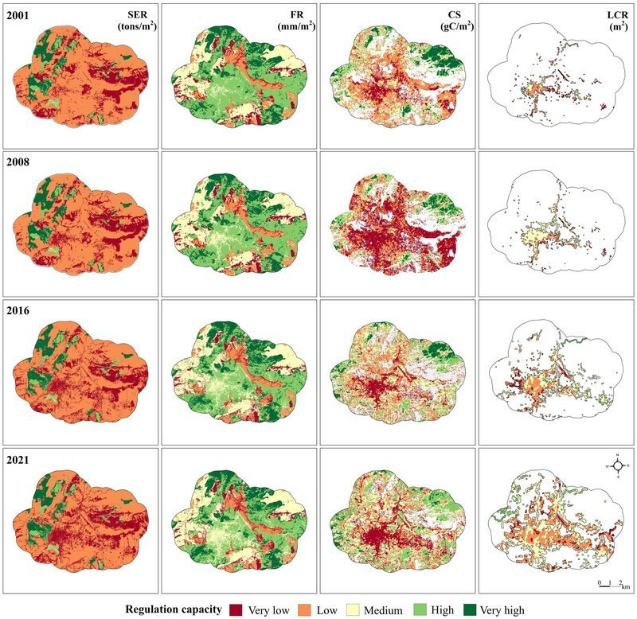

*Where can Himalayan cities grow without compromising ecosystem resilience?*   
**Past, Present & Future of Ecosystem Services — Western Himalaya**

Ecosystem Services · Flood Regulation · Carbon Sequestration · Soil Erosion · Heat Mitigation · Climate Scenarios

Flood regulation, carbon sequestration, soil erosion, and local heat mitigation — 
spatio-temporally quantified, hotspot-mapped, and projected under three combined 
planning and climate change scenarios across two Himalayan urban landscapes. 
Which areas are crucial for each ecosystem service? Where can development expand 
without compromising ecosystem resilience?

[View full project →](projects/ecosystem-services.qmd)

*Where do flood risk, erosion, and heat stress converge — and where do opportunities for nature's recovery lie?*   
**Compound Hazard Zones — Western Himalaya**

Compound Hazard · Ecosystem Services · Nature-Based Solutions · Mountain Cities · Conservation & Restoration Planning · R

Mountain cities don't face one hazard at a time. Where flood buffering, 
erosion control, and heat regulation collapse together, compound risk zones emerge. 
This project makes that spatial convergence visible across Dharamshala and Pithoragarh — 
identifying where nature's defences have failed simultaneously, 
and translating that into conservation and restoration priorities directly 
actionable for planners.

[View full project →](projects/compound-hazard-himalaya.qmd)

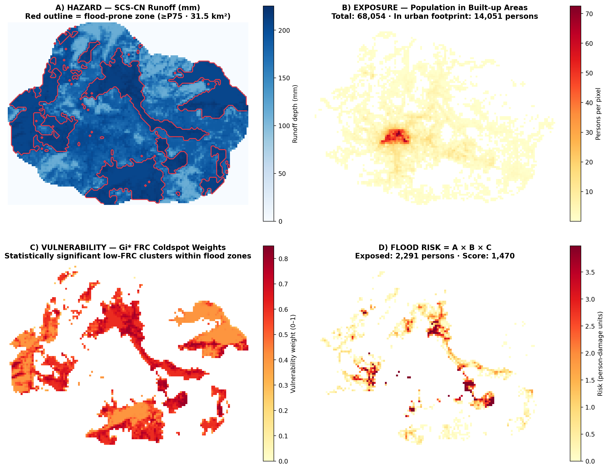

*Where and how many are at higher risk when the Himalayas flood?*   
**Flood Risk Assessment — Pithoragarh Sub-watershed**

SCS-CN Runoff · Getis-Ord Gi* · WorldPop · Ecosystem Services · Disaster Adaptation

This notebook translates biophysically modelled flood regulation ecosystem services
into a spatially explicit disaster risk framework — RISK = HAZARD × EXPOSURE × VULNERABILITY. 
Vulnerability is derived as coldspots of Flood Regulation Capacity; Exposure captures population count in built-up areas via 
WorldPop : a first-order estimate of how many lives are in harm's way, not a socioeconomic damage assessment.
No external damage curves; no global lookup tables — only locally-validated evidence used to explore number of inhabitants affected.

[View notebook →](notebooks/flood_risk_himalaya.html)

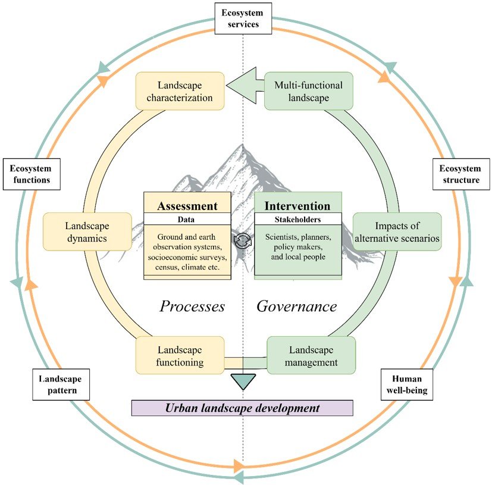

*How do ecological evidence and planning decisions connect?*   
**A Planning Framework for Sustainable Mountain Landscapes**

Landscape Ecology · Ecosystem Services · Urban Planning · Western Himalaya

Mountain planning fails not for lack of ambition, but because 
ecological evidence and governance run in separate tracks and never 
meet. This framework connects them — linking landscape assessment, 
scenario modelling, and governance into planning decisions. 
Applied across three projects in the Western Himalaya and 
transferable to any rapidly urbanising mountain landscape.

[View full project →](projects/planning-framework.qmd)

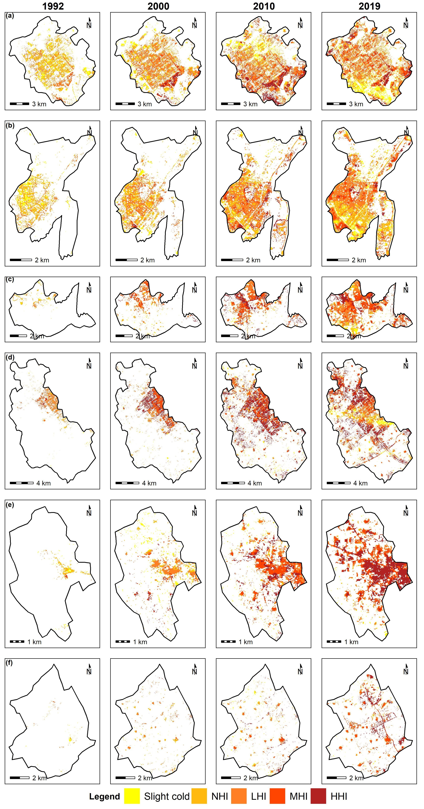

*Do smaller satellite towns run hotter than the planned city next door?*   
**Urban Heat Island — Chandigarh & Satellite Towns (1992–2019)**

Land Surface Temperature · LULC · Ecological Quality · Landsat

Counter-intuitive finding: smaller satellite towns had worse heat islands than 
the larger planned city. Green space distribution matters more than total area — 
direct implications for satellite town masterplanning across South Asia.

[View full project →](projects/urban-heat-island.qmd)

  <!-- closes project-grid -->

---

## Publications

<h3>Peer-reviewed (6)</h3>

1. Dennis, M., Huck, J., Holt, C., McHenry, E., Andersson, E., **Sharma, S.**, and Haase, D. (2026). **In search of Schrödinger's patch: A functional approach to habitat delineation.** *Landscape Ecology*, 41, 36.

2. Dennis, M., Huck, J., Holt, C., McHenry, E., Andersson, E., **Sharma, S.**, and Haase, D. (2026). **Beyond the patch: Leveraging the notion of realized habitat in fragmentation-biodiversity research.** *Landscape Ecology*, 41, 37.

3. **Sharma, S.**, Joshi, P.K., and Fürst, C. (2022). **Exploring multiscale influence of urban growth on landscape patterns of two emerging urban centres in the Western Himalaya.** *Land*, 11, 2281.

4. **Sharma, S.**, Joshi, P.K., and Fürst, C. (2022). **Unravelling net primary productivity dynamics under urbanization and climate change in the Western Himalaya.** *Ecological Indicators*, 144, 109508.

5. **Sharma, S.**, Sharma, M., Anees, M.M., and Joshi, P.K. (2020). **Longitudinal study of changes in ecosystem services in a city of lakes, Bhopal, India.** *Energy, Ecology and Environment*, 6, 408–424.

6. **Sharma, S.**, Nahid, S., Sannigarhi, S., Sharma, M., Anees, M.M., Sharma, R., Shekhar, R., Joshi, P.K., Basu, A.S., Pilla, F., and Basu, B. (2020). **A long-term and comprehensive assessment of urbanization-induced impacts on ecosystem services in the capital city of India.** *City and Environment Interactions*, 7, 1-12, 100047.

<h3>Under review (2)</h3>

1. **Sharma, S.**, Maija, T., and Andersson, E. (n.d.). Situating private urban green spaces — using transfer learning to characterise urban landscapes. *Urban Forestry and Urban Greening*.

2. **Sharma, S.**, Andersson, E., and Dennis, M. (n.d.). Qualifying and navigating urban heterogeneity for biodiversity. *Ecography*.

<h3>In progress (2)</h3>

1. **Sharma, S.**, Andersson, E., and Dennis, M. (n.d.). How scales matter? Urban ecological qualities for birds. *Ecosphere*.

2. **Sharma, S.**, Joshi, P.K., and Fürst, C. (n.d.). Rampant or ecological? Urban growth pathways in Himalaya. *Ecological Indicators*.

---

## Contact

If you are working on something where cities and their nature, forest, and spatial data
intersect & feel I could be a good addition to your team/projects - I would love to have a chat.

[📧 ssonalipduoh@gmail.com](mailto:ssonalipduoh@gmail.com) &nbsp;·&nbsp;
[LinkedIn](https://www.linkedin.com/in/sonali-sharma-50220210b/) &nbsp;·&nbsp;
[+49 152 160 44085](tel:+4915216044085) &nbsp;·&nbsp;
[+358 45 851 2118](tel:+358458512118)

📍 Goslar, Germany | 📍 Helsinki, Finland · *Open to on-site roles in Germany, Finland; and remote across Europe and beyond.*

*This portfolio is actively growing — new projects and notebooks added regularly.*