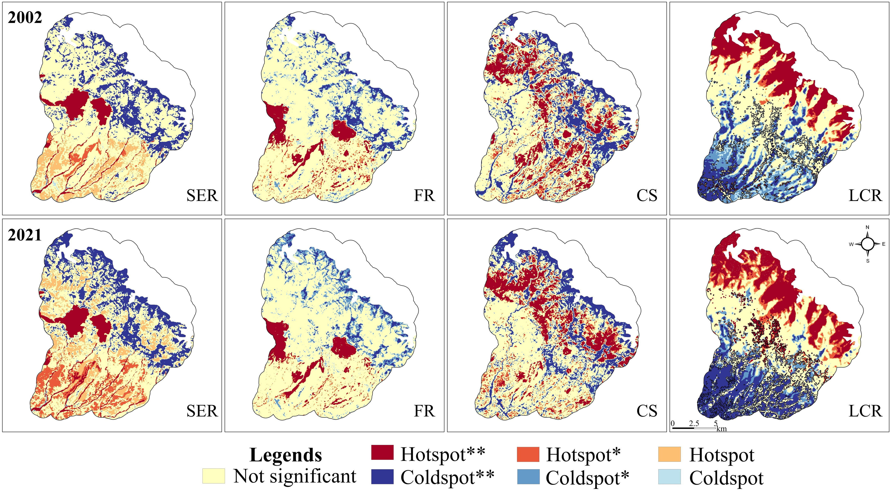
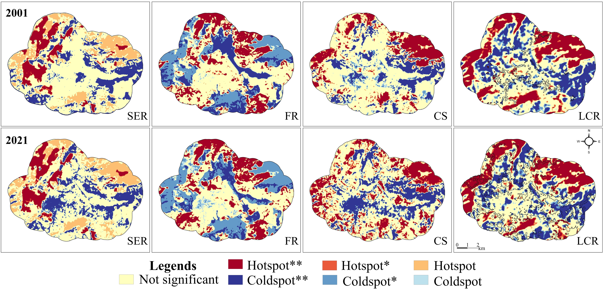

## The problem

Urban planners in Himalayan cities rarely have spatially explicit data
on what the surrounding landscape actually *does* for them — how much
runoff the forests absorb, how much carbon the vegetation sequesters,
how much cooler the city stays because of tree cover. Without this,
ecosystem services are invisible in planning decisions.

This project made them visible.

---

## Four services, two cities, four time points

I modelled and mapped four **regulation ecosystem services (RES)**
across Dharamshala (DM) and Pithoragarh (PG) at four time points
(2001/2002, 2008/2010, 2016, 2021), capturing how urbanisation has
eroded each service over two decades.

| Service | What it measures | Model / proxy |
|---------|-----------------|---------------|
| **SER** — Soil erosion regulation | Capacity to prevent soil loss | Morgan-Morgan-Finney model · soil loss (tons/m²) |
| **FR** — Flood regulation | Capacity to modulate runoff from heavy rainfall | Modified SCS-CN model adapted for mountain terrain · runoff potential (mm/m²) |
| **CS** — Carbon sequestration | Carbon captured and stored by vegetation | CASA model · ESTARFM fusion (MODIS + Landsat 30 m) · NPP (gC/m²) |
| **LCR** — Local climate regulation | Vegetation-mediated cooling of ambient temperature | Land surface temperature index · urban boundary delineation |

The flood regulation model used a **mountain-adapted modification** of
the SCS curve number approach (Azmal et al. 2020) — standard SCS-CN
models underestimate runoff in steep terrain, so this adaptation was
essential for realistic estimates in Himalayan landscapes.

---

## Maps — spatiotemporal patterns

::: {layout-ncol=2}
{fig-alt="Grid of maps showing
soil erosion regulation, flood regulation, carbon sequestration and local
climate regulation in Dharamshala across four time points"}

{fig-alt="Grid of maps showing
four regulation ecosystem services in Pithoragarh across four time points"}
:::

Each row is a time point; each column is a service. Reading down any
column shows how that service has changed as the city grew. Reading
across any row shows the spatial co-occurrence of services — where
high-value areas for one service overlap with others, revealing
multi-functional landscape patches worth prioritising for protection.

---

## Hotspot and coldspot analysis

Beyond the maps, I identified statistically significant spatial clusters
of high-value (hotspots) and low-value (coldspots) areas for each
service using local spatial autocorrelation. These hotspot maps are
the most planning-actionable output — they tell a city planner exactly
*where* to focus protection efforts.

::: {layout-ncol=2}
{fig-alt="Hotspot and coldspot maps for four ecosystem services in Dharamshala"}

{fig-alt="Hotspot and coldspot maps for four ecosystem services in Pithoragarh"}
:::

---

## Future ecosystem services under growth scenarios

The same services were projected forward to 2040 under the three
urban growth scenarios modelled in the
[urban growth project](urban-growth-scenarios.qmd) — BAU, ESP, and SED.
This closes the loop: the scenario maps show *where* land cover changes;
the future ES maps show *what those changes cost* in terms of
flood protection, carbon, and climate regulation.

::: {layout-ncol=2}
{fig-alt="Maps of projected
soil erosion regulation and flood regulation in Pithoragarh in 2040
under BAU ESP and SED scenarios"}

{fig-alt="Maps of projected
carbon sequestration and local climate regulation in Pithoragarh in
2040 under BAU ESP and SED scenarios"}
:::

::: {layout-ncol=2}
{fig-alt="Maps of projected
soil erosion regulation and flood regulation in Dharamshala in 2040
under BAU ESP and SED scenarios"}

{fig-alt="Maps of projected
carbon sequestration and local climate regulation in Dharamshala in
2040 under BAU ESP and SED scenarios"}
:::

---

## Key findings

Regulation ecosystem services declined across both cities over the
study period, with the steepest losses in flood regulation and local
climate regulation — the two services most directly tied to vegetation
cover in built-up areas. Under the BAU and SED scenarios, these
losses accelerate substantially by 2040. The ESP scenario retains
significantly more ES capacity, particularly in the forest buffer
zones identified as hotspots in the current analysis.

---

## Publications

- **Sharma, S.**, Joshi, P.K., and Fürst, C. (2022). Unravelling net
primary productivity dynamics under urbanisation and climate change
in the Western Himalaya. *Ecological Indicators*, 144, 109508.