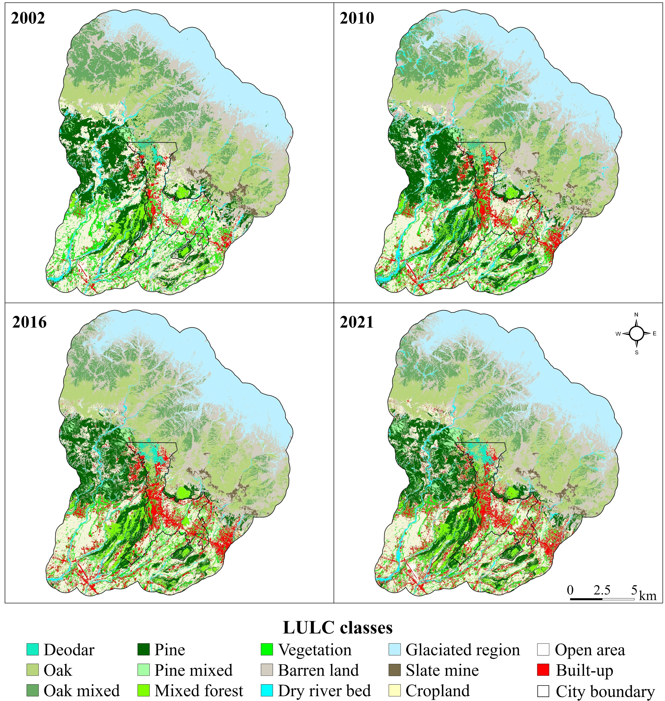
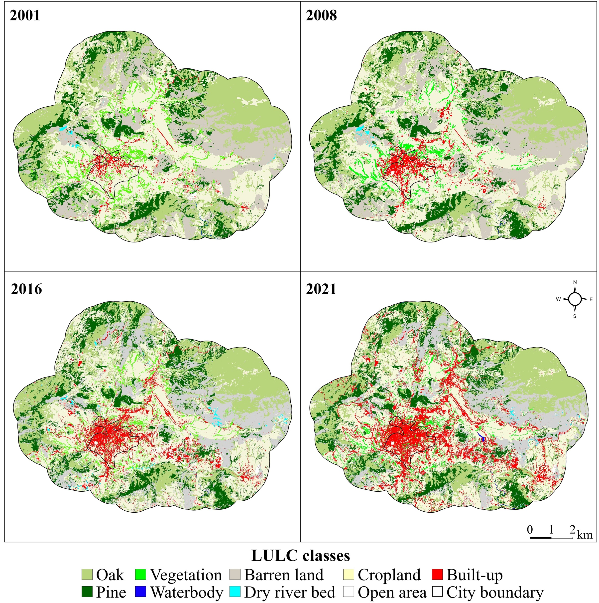

## The Planning Challenge

Mountain cities in the Western Himalaya are growing fast, and mostly
without a mapped plan. Road corridors, drainage networks, forest buffer
zones, and settlement boundaries are routinely planned without knowing
what the land looked like five years ago, let alone twenty.

The result? Cropland converted to concrete on slopes that flood.
Forest patches severed with no record of the green infrastructure that
just disappeared. Infrastructure built where the terrain says otherwise.

The data gap is worst for medium-sized towns, exactly where most of
South Asia's future urbanisation will land. Large cities get studied.
Hill stations and border towns do not.

This project put two of those towns on the map, in detail, over two
decades, using open-access satellite data, to support evidence-based
planning in mountain landscapes.

---

## What Was Done

Two rapidly growing Himalayan towns were selected because they grow
differently and are governed differently, making the findings
transferable beyond a single case:

- **Dharamshala, Himachal Pradesh.** A tourism hub and India's first
  Smart City in its state, growing linearly along road corridors up
  the valley.
- **Pithoragarh, Uttarakhand.** A border district headquarters
  spreading radially across the Saur valley, constrained by steep
  ridgelines on multiple sides.

Satellite imagery was captured at four time points across two decades
and classified into **12 land cover classes**. Not just "built" and
"green", but Deodar, Oak, Pine, Mixed Forest, Cropland, Dry River Bed, and more. That level of detail matters: a
planner designing a forest buffer needs to know whether they are
protecting Deodar or Pine, not just "trees."

Classification accuracy was independently validated at **89–95%**
across all time points.

**Tools:** Google Earth Engine, ArcGIS, ENVI, CARTOSAT-DEM

---

## Maps

::: {#fig-lulc layout-ncol=2}

Land use and land cover change across both study sites, 2002–2021.
:::
In Dharamshala (left), red built-up patches expand steadily from the
valley floor upward, concentrated along road corridors, replacing
cropland and fragmenting the Oak and Mixed Forest patches on the
mid-slopes.  

In Pithoragarh (right), the city core from 2001 is barely
visible. By 2021, built-up land has spread in every direction across
the Saur valley. The Oak and Pine forest at the outer edge stays
comparatively intact, a visible sign of reserved forest protection
holding the line where municipal planning has not.
---

## What the Data Shows

- Built-up land nearly **doubled in Dharamshala** (+104%) and
  **increased almost fivefold in Pithoragarh** (+387%) over twenty
  years.
- In both cities, **cropland went first.** The agricultural buffer
  between towns and forests was the primary casualty of expansion.
- Dharamshala lost **17% of its cropland**, 2% of vegetation, and 1%
  of forest cover. Pithoragarh lost **15% of cropland, 11% of
  vegetation, and 15% of forest.**
- Growth accelerated sharply in the second decade, triggered by Smart
  City investment, road expansion, and tourism infrastructure.
- The two cities grew in fundamentally different shapes. Dharamshala
  spread outward in **multiple disconnected clusters.** Pithoragarh
  expanded as a **single continuous core**, absorbing surrounding land
  in every direction.

**Growth morphology diverged by topography**

- **Pithoragarh** evolved as a **single-core expansion**, with
  built-up patches connecting and aggregating in all directions
  from the city centre as an continuous, radial sprawl pattern.
- **Dharamshala** exhibited **multi-core network expansion** : with
  scattered newer built-up patches emerging beyond city limits,
  particularly in the western direction, interlaced with cropland
  and forest fragments.

---

## What Planners Can Do With This

This study produces decision-ready spatial intelligence across following planning domains:

**Set urban growth boundaries on actual evidence**
A 20-year land conversion record shows exactly where growth pressure
is highest and which zones are next in line. That is the evidence base
a masterplan revision actually needs, rather than arbitrary buffers
drawn on administrative maps.

**Protect the right forest patches**
Species-level maps show not just how much forest has been lost, but
which types and where. Deodar, Pine, Oak, mixed types: each has
different ecological value and different legal standing under India's
Forest Conservation Act. The accelerating forest loss during
Dharamshala's high-growth decade is an early warning that corridor
protection needs to happen before the next infrastructure cycle, not
after.

**Screen for disaster risk before permits are issued**
Cropland converted to built-up on steep Himalayan slopes is a
reliable predictor of landslide and flood risk. Overlaying these
change maps with slope and drainage data creates a spatial risk screen
that can sit inside any permitting workflow, shifting from reactive
response after a disaster to pre-screening before construction begins.

**Make ecosystem service trade-offs visible**
Species-level LULC information feed directly
into carbon sequestration, flood regulation, local climate regulation,
and soil erosion models (see the Ecosystem Services project). These
maps give planners and EIA teams the spatial inputs to make urbanisation and climate change based
trade-offs explicit rather than invisible in impact assessments and municipal SDG
reporting.

---

## Publications

- **Sharma, S.**, Joshi, P.K., and Fürst, C. (2022). Exploring
  multiscale influence of urban growth on landscape patterns of two
  emerging urban centres in the Western Himalaya. *Land*, 11, 2281.
  [https://doi.org/10.3390/land11122281](https://doi.org/10.3390/land11122281)

