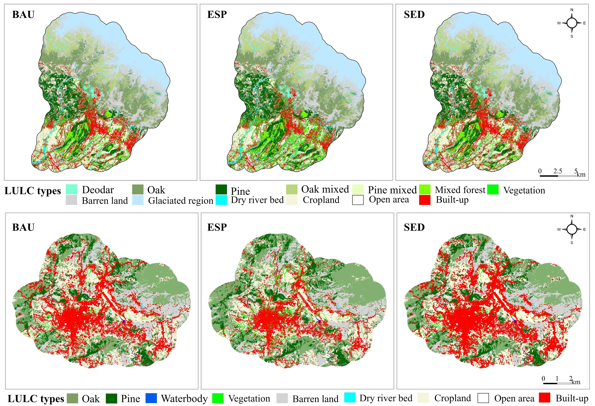

## The Question

Medium-sized cities in mountainous region sit at a crossroads. They are growing
fast enough to matter ecologically, but still small enough that
planning decisions can meaningfully shape what they look like in
twenty years. The question is not whether they will grow. 
They are and will continue growing tremendously. The question is how, and at what cost to the landscapes they depend on.

To make that question concrete, three plausible futures were modelled
for Dharamshala and Pithoragarh up to 2040 — not to predict what will
happen, but to show planners and policymakers what each path looks
like on the ground before they commit to it.

---

## What Was Done

A CA-Markov simulation framework was calibrated in TerrSet software against observed land
cover transitions from 2002 to 2021 (see the LULC Change project).
Three scenarios were built by modifying the transition probability
matrix to reflect different planning and governance assumptions:

| Scenario | Urban growth | Ecosystem protection | Logic |
|---|---|---|---|
| **BAU** — Business as Usual | Follows historical trend | None | Growth continues unchecked |
| **ESP** — Ecosystem Protection | 20% less than BAU | Cropland converts to forest; barren land restored | Ecological Conservation priorities in force |
| **SED** — Socio-economic Development | 20% more than BAU | None | Development-first priorities |

The maps were designed from the outset to be used in stakeholder
deliberation — translating model outputs into spatial narratives that
planners, municipal authorities, and local communities can engage with
directly.

**Tools:** IDRISI/TerrSet · ArcGIS ·
**Data:** Calibrated LULC maps 2002–2021 · Topographic constraints

---

## Projected LULC 2040

::: {#fig-scenarios layout-ncol=1}
{fig-alt="Three-panel map showing projected land cover in Dharamshala and Pithoragarh in 2040 under BAU, ESP and SED scenarios"}

Dharamshala and Pithoragarh — projected land cover in 2040 under three planning scenarios.
:::

The contrast is visible. Under ESP, forest patches are retained and
partially restored. Under SED, red built-up dominates valley
floors and spreads onto terrain that was forested in 2021. BAU sits
between the two, but still entails substantial and largely irreversible
loss.

---

## What Planners Can Do With This

**See the cost of inaction before it is too late**
The BAU scenario is not a neutral baseline. It is a projection of
what happens if planning capacity stays where it is today. For
Pithoragarh, that means the built-up footprint more than doubles
in under twenty years, with vegetation and cropland absorbing the
majority of that cost.

**Use ESP as a design target, not just a model output**
The ecosystem protection scenario shows that meaningful reversal is
spatially possible. Forest gains of 24–31% are achievable if
planning actively included conservation
zoning, reforestation incentives, and constrained infrastructure
permitting. These are concrete, implementable policy levers.

**Plan by trajectory, not by average**
The three scenarios diverge most sharply in the outer zones of both
cities, where planning authority is weakest and growth pressure is
highest. That is exactly where scenario-informed zoning can have the
most impact, because land conversion there is needs more control to limit irreversible & similar mistakes.

**Feed scenarios into ecosystem service and climate risk assessments**
Each trajectory carries a different profile of flood regulation
capacity, soil erosion, carbon storage, and local heat regulation. The LULC
projections here connect directly to those calculations (see the
Ecosystem Services project), giving EIA teams and municipal climate
offices a spatially explicit basis for evaluating what each planning
path actually costs in ecosystem terms.

---
## Publication

**Sharma, S.**, Joshi, P.K., and Fürst, C. (in progress). Rampant or
ecological? Urban growth pathways in Himalaya. *Ecological Indicators.*

